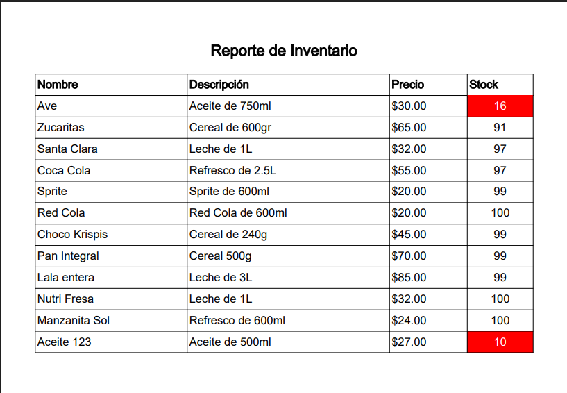

# Tienda Online - Sistema Web de Compras

Proyecto desarrollado por **José de Jesús Castillo Nolasco** como parte de una plataforma completa de comercio en línea.

---

## 📄 Descripción
**TiendaOnline** es una aplicación web construida con Spring Boot que permite a los usuarios explorar productos, agregarlos a un carrito, realizar pedidos y descargar comprobantes de pago en PDF. Además, incluye un panel administrativo para la gestión de usuarios, productos, pedidos y reportes.

---

## 🚀 Tecnologías utilizadas
- **Java 17** y **Spring Boot**
- **Spring Security** para autenticación segura
- **Thymeleaf** para renderizado de vistas
- **MariaDB** como sistema gestor de base de datos
- **Spring Data JPA** para persistencia
- **iText PDF** para generación de comprobantes
- **Apache POI** para exportación de reportes en Excel
- **Bootstrap + CSS personalizado** para la interfaz gráfica

---

## 📊 Características principales
### Cliente
- Registro y login seguro 
- Navegación de productos
- Carrito de compras
- Gestión de direcciones de envío
- Realización de pedidos
- Descarga de comprobante de pedido en PDF

### Administrador
- Gestión de productos (alta, edición, eliminación)
- Gestión de usuarios
- Visualización de pedidos con filtros
- Reportes de inventario y ventas (PDF y Excel)

---

## 🔧 Instalación y ejecución
1. Clonar el repositorio:
```bash
git clone https://github.com/usuario/TiendaOnline.git
```

2. Importar como proyecto Maven en tu IDE (recomendado: IntelliJ IDEA)

3. Configurar la base de datos en `application.properties`:
```properties
spring.datasource.url=jdbc:mariadb://localhost:3306/miTienda
spring.datasource.username=usuario
spring.datasource.password=contraseña
```

4. Ejecutar la aplicación:
```bash
./mvnw spring-boot:run
```

5. Acceder desde el navegador:
```
http://localhost:8080
```
## 🛠️ Inicialización de la Base de Datos

Este proyecto incluye la inicialización automática de la base de datos utilizando los archivos `schema.sql` y `data.sql` ubicados en el directorio `src/main/resources`.

### ✅ ¿Cómo funciona?

Spring Boot está configurado para ejecutar automáticamente estos archivos al iniciar la aplicación. Esto crea las tablas necesarias (`schema.sql`) y carga datos iniciales (`data.sql`) para que puedas probar el sistema de inmediato.

### 📄 Configuración en `application.properties`

Asegúrate de tener estas líneas en tu archivo `application.properties` para que la inicialización funcione correctamente:

```properties
spring.sql.init.mode=always
spring.sql.init.schema-locations=classpath:schema.sql
spring.sql.init.data-locations=classpath:data.sql
```

> 🔍 *Nota:* Ten configurado tu motor de base de datos MariaDB, asegúrate de crear la base de datos "miTienda" para que la inicialización funcione correctamente
> y los parámetros de conexión (`spring.datasource.url`, `username`, `password`, etc.)
---
## 🔐 Usuario Administrador por Defecto

Al iniciar la aplicación por primera vez, se inserta automáticamente un usuario administrador para facilitar las pruebas del sistema.

- **Correo:** `admin@example.com`
- **Contraseña:** `Admin123`
---

## 🌐 Roles y accesos
- **CLIENTE**: Puede navegar, comprar y gestionar su información.
- **ADMIN**: Accede a paneles de administración, reportes y mantenimiento del sistema.

---

## 📷 Capturas de pantalla

### 🏠 Página de inicio de sesión


### 👤 Registro de usuario


### 🛍️ Página principal de inicio


### 🧺 Página principal de productos


### 🛒 Carrito de compras


### 💳 Confirmar carrito


### 💵 Confirmación de pedido


### 🖨️ Comprobante de pago


### 💁‍♂️ Perfil de usuario


### 🙋‍♂️️️ Editar perfil


### 🚗 Direcciones de envío


### 🚁 Editar direcciones


### 🧾 Historial de pedidos


### 👀 Detalles de pedido


### 👥 Gestion de usuarios


### 🖱️ Editar usuarios


### 📦 Gestión de productos


### 🏷️ Agregar producto


### 📋 Reportes de inventario



### 📊 Gestión de ventas


### 📈 Reporte de ventas


### 📋 Gestión pedidos

---
## ✍️ Autor

<div style="display: flex; align-items: center; justify-content: space-between;">
  <div>
    <strong>José de Jesús Castillo Nolasco</strong> 👨‍💻<br>
    Desarrollador Backend Java Junior 💻 ☕ 🚀
  </div>
  
</div>

[LinkedIn](https://www.linkedin.com/in/jose-castillo-nolasco/)
[Portafolio](#)
---
